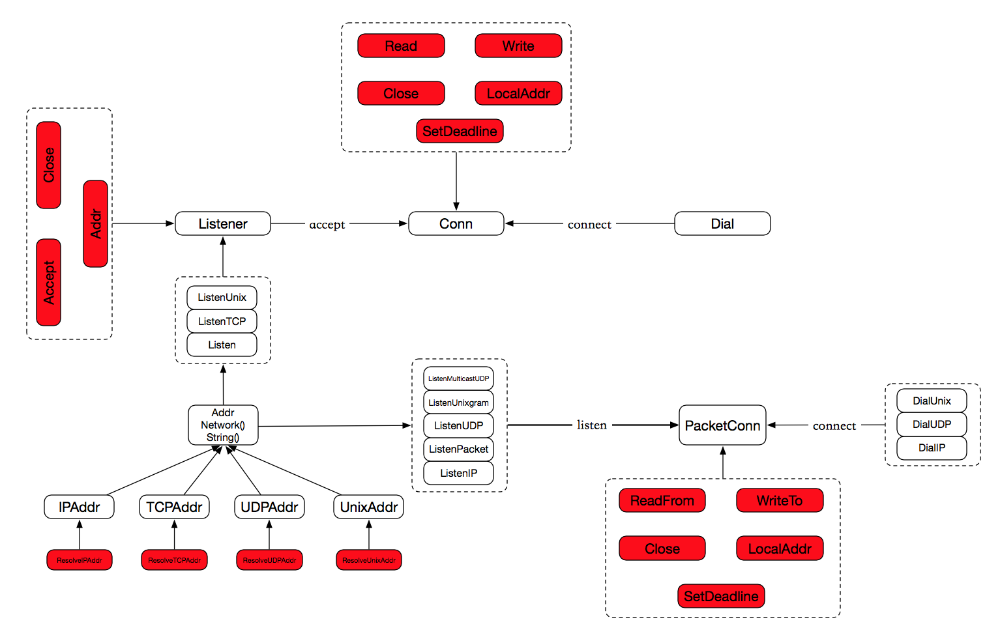

# net

## 关系图



1. Package net provides a **portable** interface for network I/O, including TCP/IP, UDP, domain name resolution, and Unix domain sockets.
2. Although the package provides access to **low-level networking primitives**.
3. most clients will need only the basic interface provided by the **Dial**, **Listen**, and **Accept** functions and the associated **Conn** and **Listener** interfaces.
4. The crypto/tls package uses the same interfaces and similar Dial and Listen functions.

## Name Resolution

1. 域名解析的时机：间接解析（Dial）和直接解析（LookupHost and LookupAddr）；
2. 域名解析的方法：不同的操作系统使用不同的域名解析方法；
3. 在Unix系统中，解析域名的方法有两种，pure Go resolver 和 cgo-based resolver.
4. pure Go resolver: sends DNS requests directly to the servers listed in /etc/resolv.conf
5. cgo-based resolver: calls C library routines such as getaddrinfo and getnameinfo
6. 默认解析方法是pure Go resolver，因为这种解析方法只会阻塞一个协程；而cgo-based resolver会阻塞一个线程。

>
- 注意：/etc/hosts会优先起作用的

## 网络接口

每个网络设备（也称网络接口）拥有以下属性信息：

```
type Interface struct {
	Index        int		// 每个网络接口都拥有唯一的编号，从正整数1开始；
	MTU          int		// maximum transmission unit
	Name         string	// 每个网络接口都拥有唯一的名称；
	HardwareAddr HardwareAddr // Mac地址
	Flags        Flags        // 见下文
}
```

Flags的构造方式如下：

```
type Flags uint

const (
	FlagUp           Flags = 1 << iota // 接口处于启用状态
	FlagBroadcast                      // 接口支持广播
	FlagLoopback                       // 接口是回环接口
	FlagPointToPoint                   // 属于点到点链路（point-to-point link）
	FlagMulticast                      // 接口支持多播
)

func (f Flags) String() string
```

>
> golang没有为Flag定义类型，而是为Flags定义新类型；
> Flag是一个常量，没有类型；
> 类型之间的关系对应到位运算

相关函数如下：

```
func InterfaceByName(name string) (*Interface, error)
func interfaceByIndex(ift []Interface, index int) (*Interface, error)
func (ifi *Interface) Addrs() ([]Addr, error)
func (ifi *Interface) MulticastAddrs() ([]Addr, error)
```

>
> 可见，一个接口上可以设置多个地址；
> 地址可分类为：unicast interface addresses 和 multicast interface addresses.

## 接口地址

```
type Addr interface {
    Network() string // 指定网络协议名称
    String() string  // 指定网络协议对应的地址
}
```

>
- 这是一个接口，接口的目的如下
- The two methods Network and String conventionally return strings that can be passed as the arguments to Dial
- 实现该接口的类型有：IPAddr, UDPAddr, TCPAddr, UnixAddr.
- 我们通过```func ResolveXXXAddr(net, addr string)```，即可构造不同类型的地址；
- 虽然没有类似```func ResolveAddr(net, addr string) Addr```的方法，但是Dial拥有类似的功能

## Dial

不同的网络协议，对应不同的网络地址。

```
// tcp or udp
// For TCP and UDP networks, addresses have the form host:port.
// Dial("tcp", "192.0.2.1:80")     基本形式
// Dial("tcp", "golang.org:http")  间接进行域名解析，但只会与其中一台主机建立连接
// Dial("tcp", "[fe80::1%lo0]:80") 同时支持ipv4和ipv6
// Dial("tcp", ":80") 
// 以IPV4为例：0.0.0.0 as a target address, In practice connecting
// to 0.0.0.0 is equivalent to connecting to localhost. When binding,
// they’ll receive packets addressed to any IPv4 address on the system.
// 即绑定了该host的所有网络地址
//
// ip
// For IP networks, the network must be "ip", "ip4" or "ip6" followed
// by a colon and a protocol number or name
// the addr must be a literal IP address. 不支持域名解析
// Dial("ip4:1", "192.0.2.1")
// Dial("ip6:ipv6-icmp", "2001:db8::1")
// 注意：需要使用net.DialIP，因为
//     1. net.Dial更适合于stream-oriented套接字；
//     2. conn.Read读取的数据中会包含IP报文的头部;
//
// unix
// For Unix networks, the address must be a file system path.
// Unix套接字通信基础：1. Unix套接字也支持两种通信方式：unixgram（消息） 和 unixpacket(流式)
// Server端首先创建一个新的socket文件并监听连接，接收连接并处理，关闭监听套接字，删除socket文件。
// 借助nc模拟客户端. nc -U /tmp/aaabc.socket

func Dial(network, address string) (Conn, error)
```

## Conn VS PacketConn

通过关系图我们知道,

Conn拥有以下方法:

```
Read(b []byte) (n int, err error)
Write(b []byte) (n int, err error)
Close() error
LocalAddr() Addr
RemoteAddr() Addr
SetDeadline(t time.Time) error
SetReadDeadline(t time.Time) error
SetWriteDeadline(t time.Time) error
```

PacketConn拥有以下方法：

```
ReadFrom(b []byte) (n int, addr Addr, err error)
WriteTo(b []byte, addr Addr) (n int, err error)
Close() error
LocalAddr() Addr
SetDeadline(t time.Time) error
SetReadDeadline(t time.Time) error
SetWriteDeadline(t time.Time) error
```

>
- 这是两个接口
- 实现net.PacketConn的类型有：IPConn, UDPConn, UnixConn。该接口主要面向packet-oriented连接，即读操作的另一端可能会来自多个client，所以ReadFrom的返回值中包含了地址信息。
- 实现net.Conn的接口有：上面的类型 + TCPConn。该接口主要面向stream-oriented连接，即连接的两端是固定的。虽然所有XXXConn都实现了net.Conn，但是利用conn.Read读取一个packet-oriented连接的数据时，返回的信息包括IP或UDP的报文头部。


### IP相关数据结构

```
type IP []byte
func ParseIP(s string) IP
func IPv4(a, b, c, d byte) IP
func (ip IP) Equal(x IP) bool
func (ip IP) String() string

func (ip IP) DefaultMask() IPMask

子网掩码


```

## error

1. 重新定义了错误，在接口error之上提供了额外的两个方法
2. package net中定义的其它错误类型都实现Error接口

```
type Error interface {
    error
    Timeout() bool   // Is the error a timeout?
    Temporary() bool // Is the error temporary?
}
An Error represents a network error.

```

### DNSConfigError VS DNSError

```
type DNSConfigError struct {
    Err error
}
func (e *DNSConfigError) Error() string
func (e *DNSConfigError) Temporary() bool
func (e *DNSConfigError) Timeout() bool

type DNSError struct {
    Err         string // description of the error
    Name        string // name looked for
    Server      string // server used
    IsTimeout   bool   // if true, timed out; not all timeouts set this
    IsTemporary bool   // if true, error is temporary; not all errors set this
}

func (e *DNSError) Error() string
func (e *DNSError) Temporary() bool
func (e *DNSError) Timeout() bool
```

1. DNSConfigError包含的信息更少，唯一的field：Err error又显得多余了
2. DNSError拥有更丰富的错误上下文，可描述为：lookup Name on Server时，出现了Err.


cname, cidr, IPNet, ParseXXX, Mask, Accept, Resolve， Multicast, golang.org/x/net/ipv4,
DNS SRV record,simultaneously, Loopback

```
type IPNet struct {
    IP   IP     // network number
    Mask IPMask // network mask
}
```

