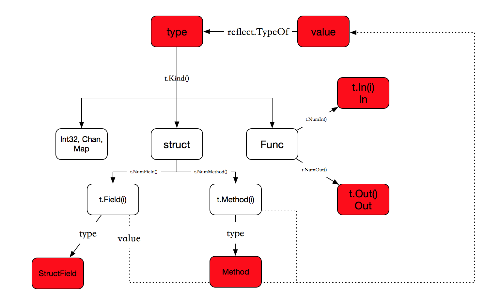

# reflect

The dynamic type information stored in an interface value can be used to
inspect the danymic value of the interface value and manipulate the values
referenced by the danymic value.

Below will only introduce the built-in reflection functionalities in Go.
In Go, built-in reflections are achieved with type assertions and type-switch
control flow code blocks. 所以，一般情况下，我们应该使用type assertions or type-switch.

## Type Assertion

interface value参与的四种conversion：

1. convert a non-interface value to an interface value,
where the type of the non-interface value must
implement the type of the interface value.
2. convert an interface value to an interface value,
where the type of the source interface value must
implement the type of the destination interface value.
3. convert an interface value to a non-interface value,
where the type of the non-interface value must
implement the type of the interface value.   // 编译通过的最基本要求，conversion不一定会成功，由运行时决定。In case of T is a non-interface type, if the dynamic type of i exists and is identical to T, then the assertion will succeed, otherwise, the assertion will fail.  When the assertion succeeds, the evaluation result of the assertion is a copy of the dynamic value of i. We can assertions of this case as value unboxing attempts.
4. convert an interface value to an interface value,
where the type of the source interface value may or may not
implement the type of the destination interface value. // 由运行时决定。In case of T is an interface type, if the dynamic type of the i exists and implements T, then the assertion will succeed, Otherwise, the assertion will fail. When the assertion succeeds, a copy of the dynamic value of i will be boxed into a T value and the T value will be used as the evaluation result of the assertion.

The convertibility for the first two are verified at compile time. The convertibility for the later two are verified at run time, by using a syntax called type assertion.

i.(T)要求如下：

1. either a non-interface type which must implement the type of i
2. or an arbrtrary interface type.

In fact, for an interface value i with dynamic type as T, the method call i.m(...) is equivalent to the method call i.(T).m(...)

Note, if a type assersion fails and the type assertion is used as a single-value expression (the second optional bool result is absent), a panic will occur.


## type-switch Control Flow Block

```
switch aSimpleStatement; v := x.(type) {
case TypeA:
	...
case TypeB, TypeC:
	...
case nil:
	...
default:
	...
}
```

If the type denoted by a type name or type literal following a case keyword in a type-switch code block is not an interface type, then it must implement the interface type of the asserted value.


package reflect 有众多类型，包括：

Method，SelectCase，SelectDir，SliceHeader，StringHeader，StructField，StructTag，
Type，Value等。关系如下：



总结如下：

1. Type和Value是最重要的两个数据结构，尤其是Value
2. reflect.Value可以对内置类型，chan、map、struct等各种类型进行操作，如SetString, SetInt, Slice, MapKeys等。
3. reflect.Type的一大作用是给出了数据类型的模型，通过XxxOf()函数即可创建出该类型的一个新的实例。例如：```ArrayOf(count int, elem Type)```, ```FuncOf(in, out []Type, variadic bool) Type```, ```StructOf(fields []StructField) Type```等结构。

>
> StructOf用于动态构造struct类型对象。
